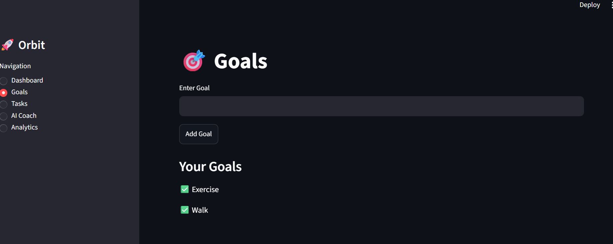
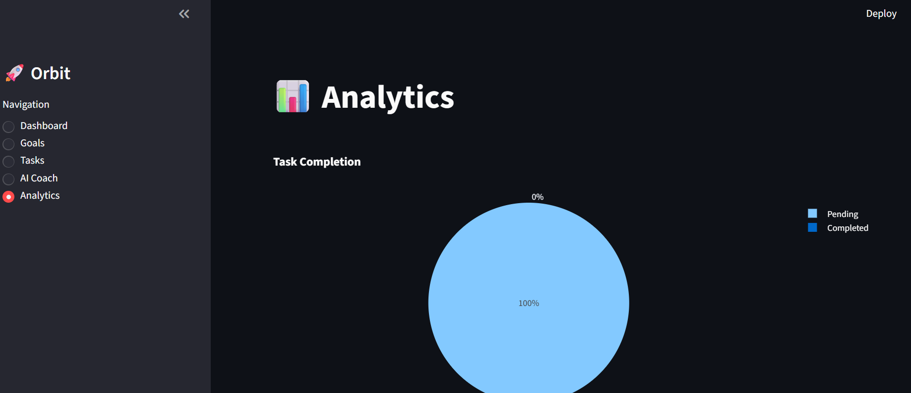

# 🚀 Orbit Mini

**Orbit Mini** is an AI-powered personal operating system built with Python and Streamlit.

The project helps users organize goals, manage tasks, visualize productivity, and receive AI-powered guidance through a simple and intuitive interface.

---

## ✨ Features

### 🎯 Goal Management

* Create and track personal goals
* Maintain a focused list of objectives

### 📝 Task Management

* Add tasks quickly
* Mark tasks as completed
* Track progress over time

### 📊 Analytics Dashboard

* Visualize task completion rates
* Monitor productivity through interactive charts

### 🤖 AI Coach

* Ask productivity and goal-related questions
* Receive AI-generated guidance and suggestions

### 🚀 Simple User Interface

* Built using Streamlit
* Fast, lightweight, and easy to use

---

## 🖥️ Tech Stack

* Python
* Streamlit
* Pandas
* Plotly
* Google Gemini API

---

## 📂 Project Structure

```text
orbit-mini/
│
├── app.py
├── requirements.txt
├── README.md
│
├── data/
│   ├── goals.json
│   └── tasks.json
│
└── modules/
    ├── goals.py
    ├── tasks.py
    └── coach.py
```

---

## ⚙️ Installation

### Clone Repository

```bash
git clone https://github.com/Muntazir-Syed/Orbit-mini.git
cd Orbit-mini
```

### Install Dependencies

```bash
pip install -r requirements.txt
```

### Run Application

```bash
streamlit run app.py
```

---

## 🔑 Gemini API Setup

Create a `.env` file:

```env
GEMINI_API_KEY=YOUR_API_KEY
```

Make sure `.env` is listed in `.gitignore`.

---

## 🎯 Future Roadmap

* Goal deadlines
* Task priorities
* Productivity scoring
* User authentication
* SQLite database integration
* Dark mode
* Advanced AI planning assistant

---

## 🌟 Vision

Orbit Mini is an early step toward **Orbit**, a broader platform designed to help individuals manage goals, learning, productivity, and decision-making through AI-powered workflows.

---

## 👨‍💻 Author

**Syed Muntazir**

GitHub: https://github.com/Muntazir-Syed
 

## 📸 Screenshots

### Dashboard



### Analytics

